<div align="center">

# AgentGlow

**Watch your AI agents work live, in 3D, from the OpenTelemetry they already emit.**

[](https://pypi.org/project/agentglow/)
[](https://www.npmjs.com/package/agentglow)
[](LICENSE)

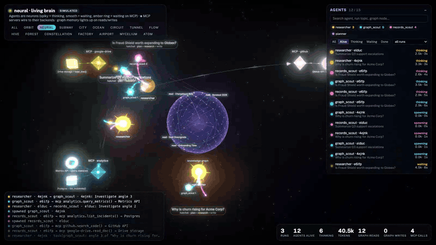

</div>

Agents spawn as glowing shapes, pulse on every LLM call, fan out to subagents, query MCP servers and databases,
and fade when they finish. One line of Python. Works with **LangChain, LangGraph, deepagents, OpenAI Agents SDK,
Hatchet, MCP**, and **Claude Code** itself.

## Quickstart

```bash
uvx agentglow serve                  # → http://localhost:8100   (or: pip install agentglow && agentglow serve)
uv add "agentglow[langchain]"        # in your agent project     ([openai-agents] for the OpenAI Agents SDK)
```
```python
import agentglow
agentglow.watch()                    # one line, before your agents run
```
Open **http://localhost:8100/neural** and run your agents. No agents yet? **http://localhost:8100/neural?sim=1**.

Already sending traces to Langfuse / LangSmith / a collector? Nothing changes: `watch()` adds AgentGlow alongside.
Any OTel exporter can also send OTLP/HTTP straight to `http://localhost:8100/v1/traces`.

## 15 themes

| | | |
|:-:|:-:|:-:|
|  **neural** | 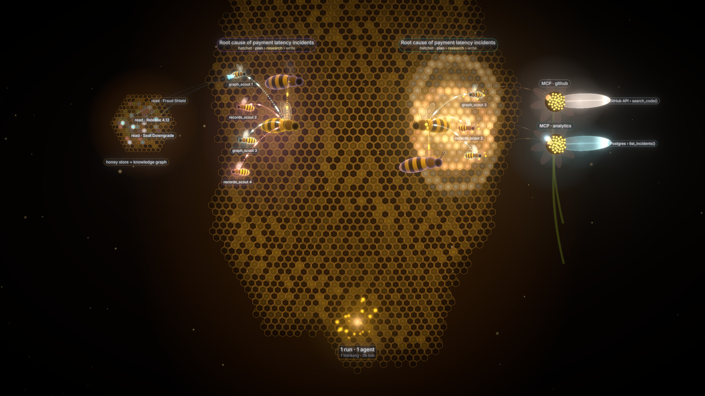 **hive** |  **constellation** |
|  **orbit** | 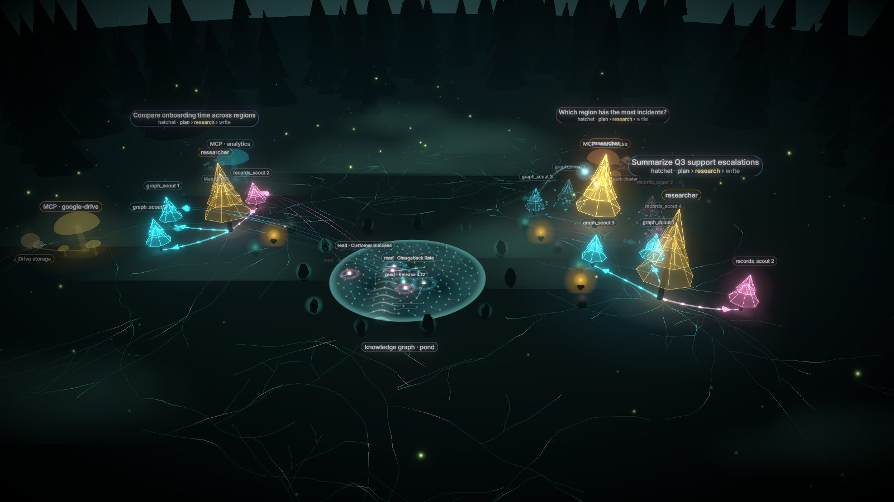 **forest** | 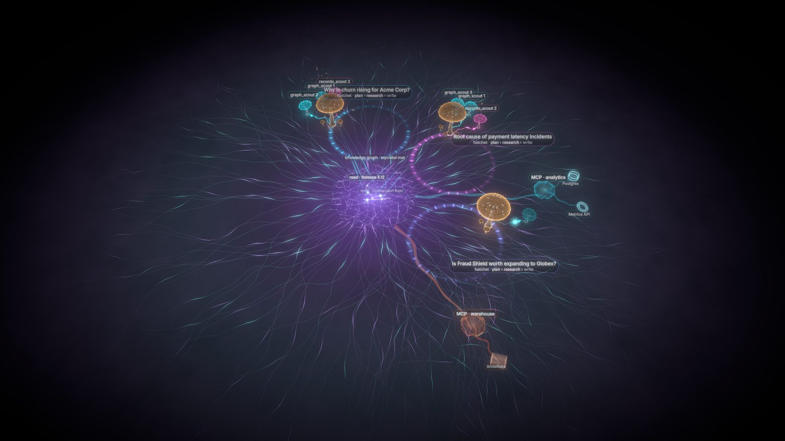 **mycelium** |
|  **atom** | 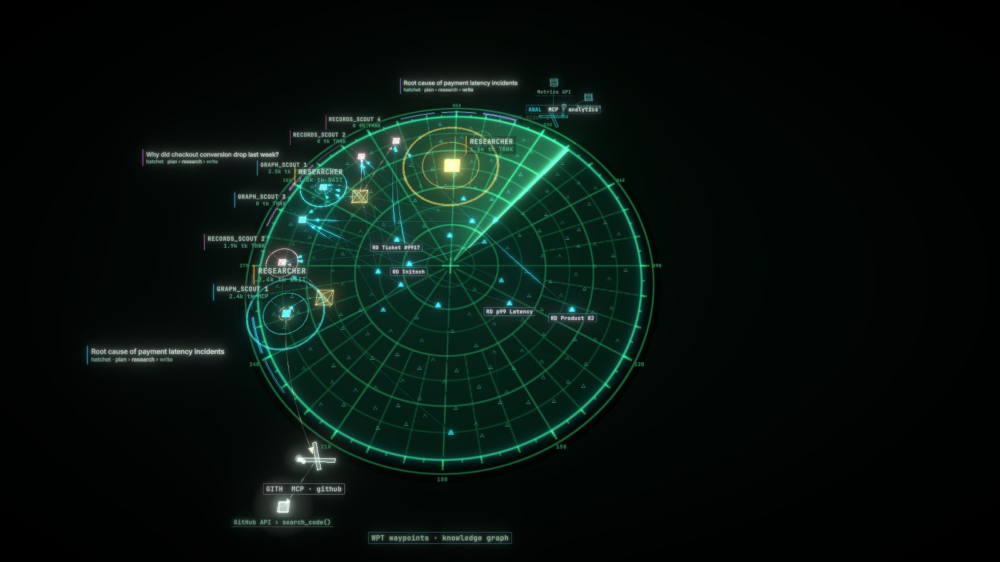 **airport** | 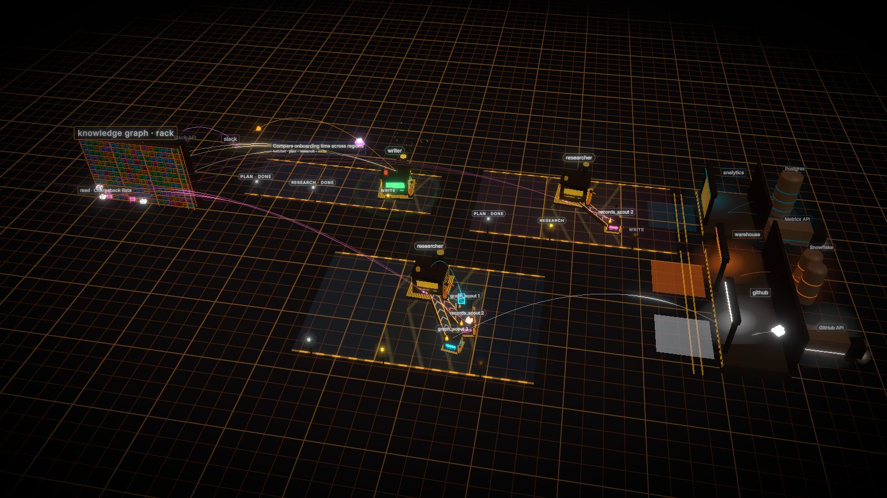 **factory** |
| 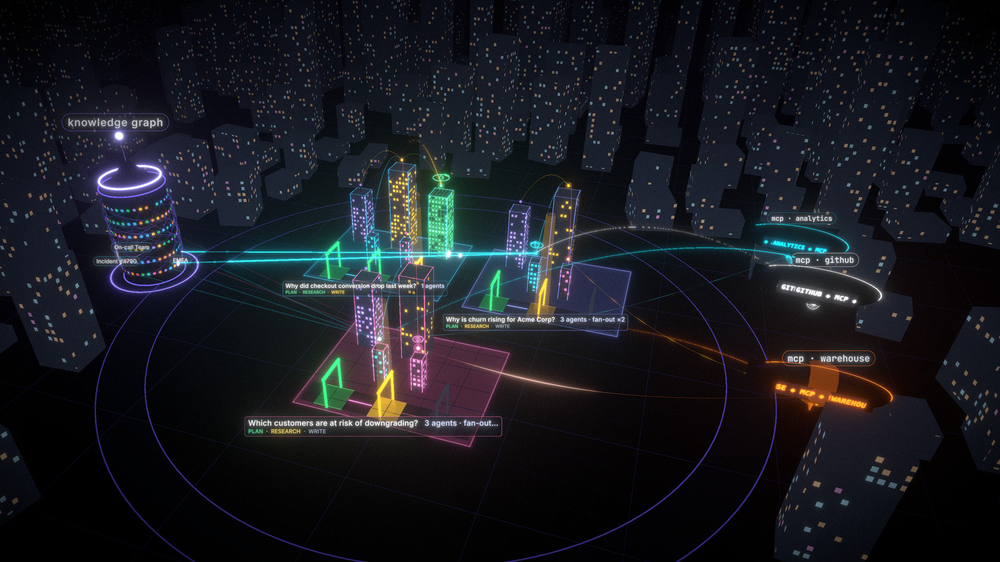 **city** | 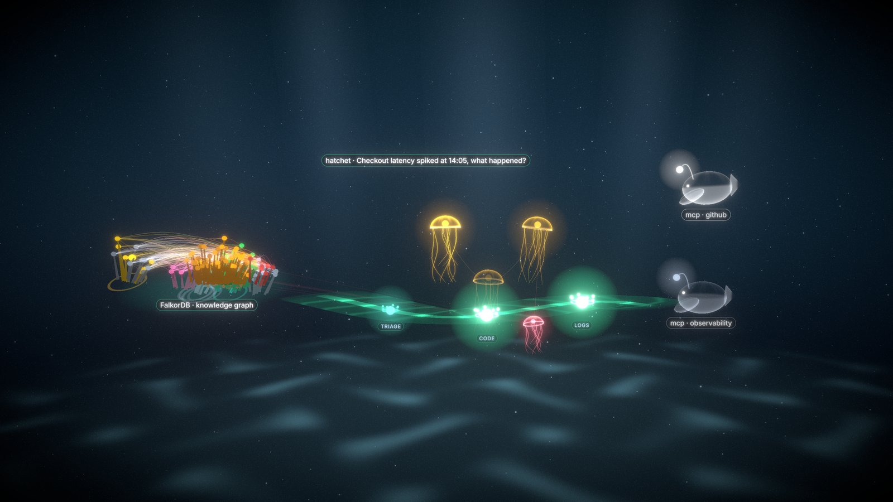 **ocean** | 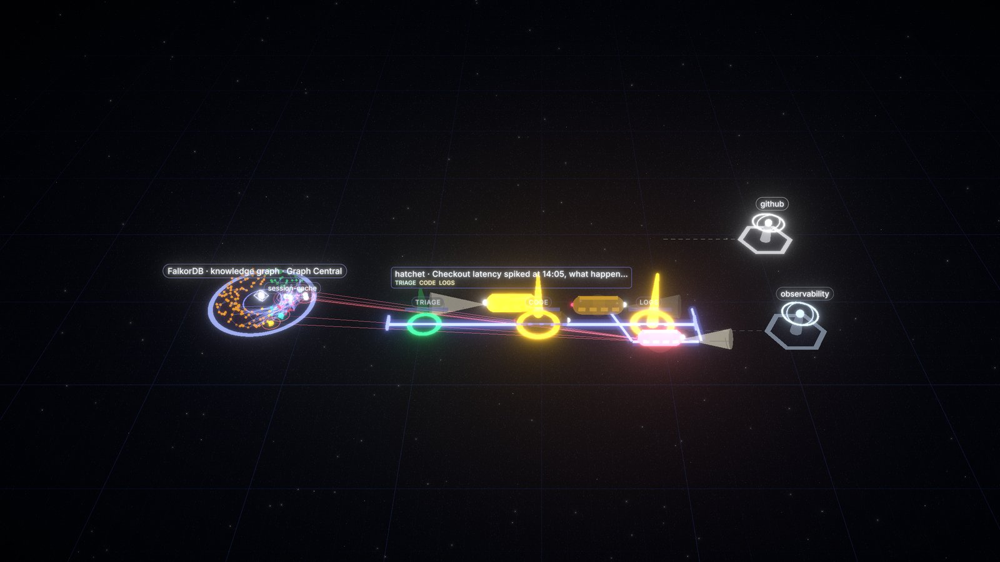 **subway** |
| 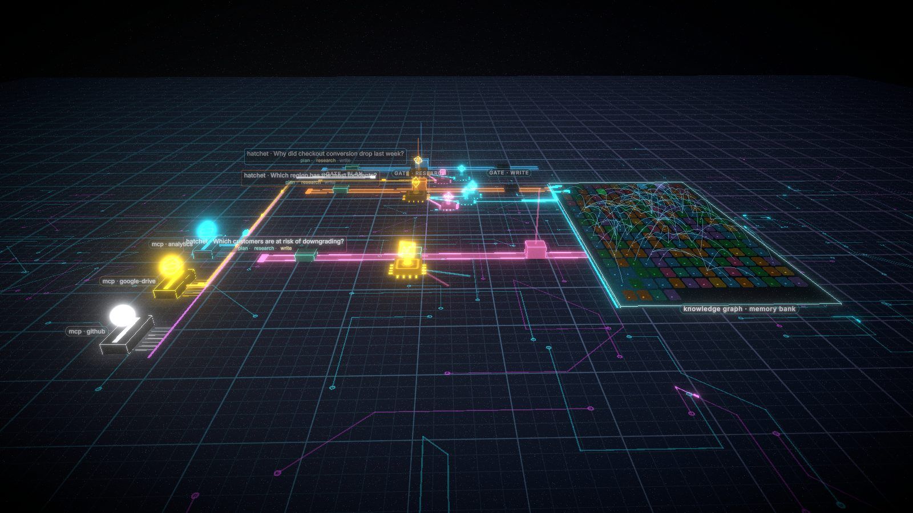 **circuit** | 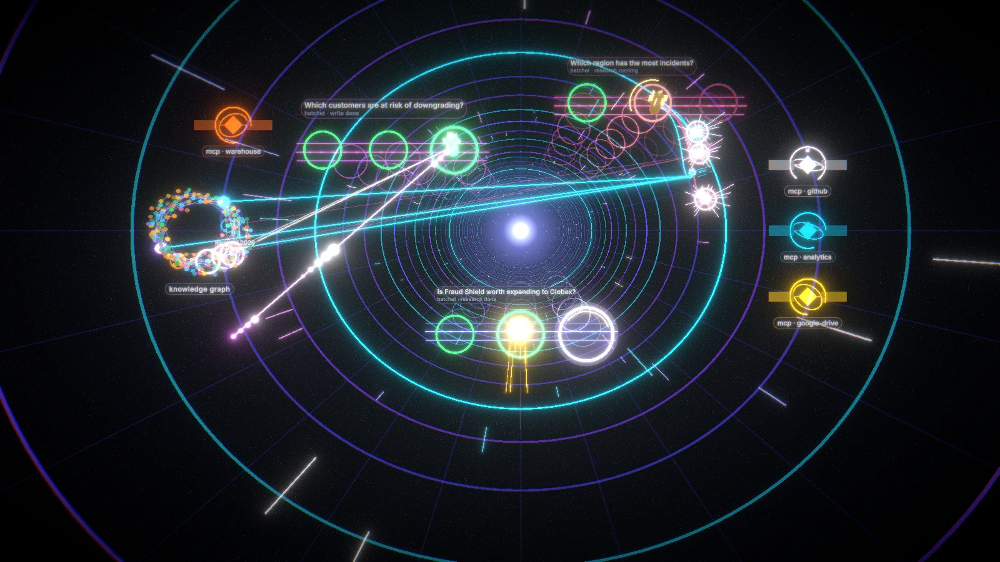 **tunnel** |  **flow** |

## In your React / Next.js app

```bash
npm i agentglow
```
```tsx
import { AgentScene } from "agentglow";

<div style={{ height: 600 }}>                {/* the scene fills its container - give it a height */}
  <AgentScene theme="neural" source="http://localhost:8100" />
</div>
```
| Prop | Default | |
|---|---|---|
| `theme` | `"neural"` | one of the 15 themes |
| `source` | `""` (same origin) | your `agentglow serve` URL (default port 8100). In a deployed app, use a URL your users' browsers can reach, e.g. `https://agentglow.yourco.com` |
| `hud` | `true` | overlay panels (title, agent list, event log, stats); `hud={false}` = just the 3D scene |
| `sim` | `false` | built-in fake agents, no server needed (also kicks in automatically if `source` is unreachable) |
| `style` | - | inline styles for the container, e.g. `{{ height: "80vh" }}` |
| `className` | - | CSS class for the container |

```tsx
<AgentScene theme="hive" sim hud={false} style={{ height: 400 }} />   // demo background, no server
```
Works in Next.js App Router out of the box (the package is `"use client"`). See [examples/react-embed](examples/react-embed).

## What shows up

| Your system | In the scene |
|---|---|
| agents / subagents | shapes that spawn, think, wait and exit - subagents smaller, linked to their parent with directional edges |
| LLM calls | pulses sized by tokens |
| tool & MCP calls | MCP server + its backends (Postgres, Snowflake, Spark…) light up, with data-flow arrows |
| DB / graph queries (`db.system`) | knowledge-graph nodes light up on reads and writes (live from FalkorDB if configured) |
| handoffs | agents chained with a message along the edge |
| Hatchet workflow runs | runs and their step-by-step progress |

**Hundreds of agents?** Above 12 live agents, AgentGlow auto-groups older runs into glowing clusters
("35 runs · 84 agents") and keeps the newest ~10 in full detail - click a cluster to expand it. Stays at ~60 fps with 500 live agents.

Optional span attributes make it richer: `agentglow.agent`, `agentglow.run.topic`, `agentglow.final`,
`agentglow.graph.nodes`, `agentglow.mcp.server` / `.resource` / `.resource_kind`. See [docs/SPEC.md](docs/SPEC.md).

## Examples

| | |
|---|---|
| [quickstart](examples/quickstart) | 40-line deepagents researcher with two subagents - the "just show me" path |
| [langgraph](examples/langgraph) | LangGraph supervisor with worker agents (`langgraph-supervisor` works too) |
| [openai-agents](examples/openai-agents) | OpenAI Agents SDK: handoffs + agent-as-tool |
| [react-embed](examples/react-embed) | `<AgentScene/>` in a Vite + React app |
| [claude-code](examples/claude-code) | watch **Claude Code** and its subagents in 3D via hooks - no code |
| [deepagents-hatchet](examples/deepagents-hatchet) | the full stack: Hatchet + deepagents + MCP + FalkorDB, one `docker compose up` |

Every Python example takes `AGENT_MODEL` - e.g. `openai:gpt-5.6-luna`, `anthropic:claude-sonnet-5`, `google_genai:gemini-3.8-flash`.

### The full stack in one command

```bash
cp .env.example .env            # add one LLM key (OpenAI, Anthropic or Gemini) - that's all the setup
docker compose up               # then open http://localhost:8100 and press ▶ Run agents
```
Optional Langfuse side by side: `./scripts/gen-obs-env.sh` then `LANGFUSE_EXPORT=1 docker compose --profile langfuse up -d`.

## Production

Run **one** `agentglow serve` per environment (Docker image / k8s Deployment with `replicas: 1`) and point every app
pod at it: `agentglow.watch("http://agentglow:8100")`. If it's down, your app is unaffected - spans are just dropped.

## Develop

One [uv](https://docs.astral.sh/uv/) workspace (root `pyproject.toml`, single `uv.lock`; members `backend` + the Python examples).

```bash
uv sync --all-packages                              # everything into ./.venv
(cd frontend && npm ci && npm run build:app)        # bundle the UI into backend/agentglow/static
uv run agentglow serve                              # :8100
uv run --package agentglow pytest backend/tests -q
uv build --package agentglow --out-dir dist         # sdist + wheel
```

| Path | |
|---|---|
| `backend/` | Python package `agentglow`: server, `watch()`, OTel → agent mapping, Claude Code hooks |
| `frontend/` | the 3D scenes; npm package `agentglow` + the app bundled into the Python package |
| `examples/` | real agent stacks instrumented with one line |

MIT licensed.
