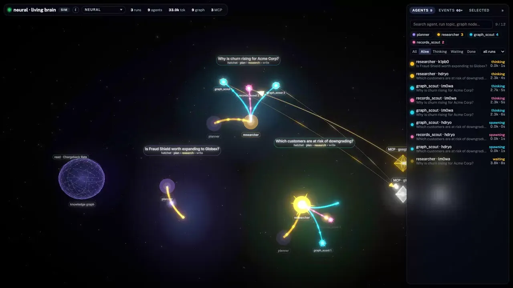
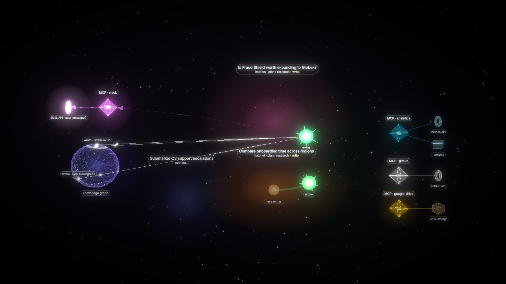
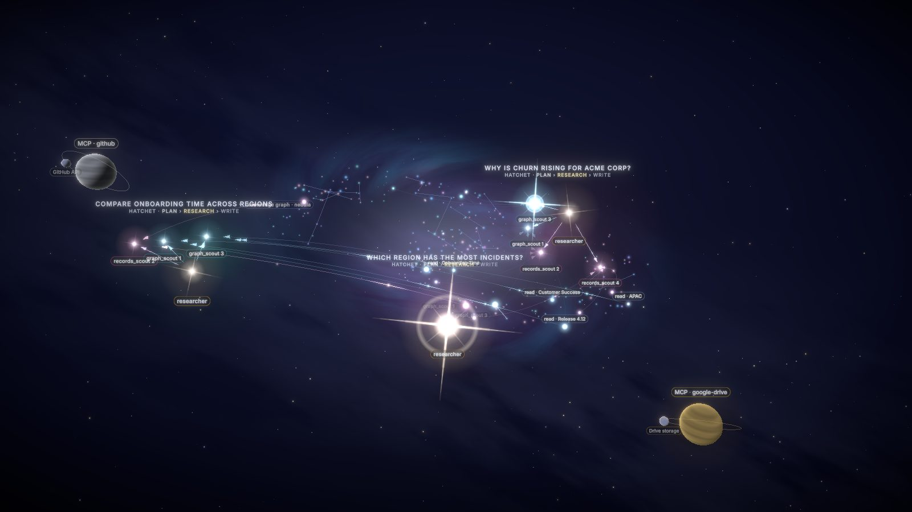
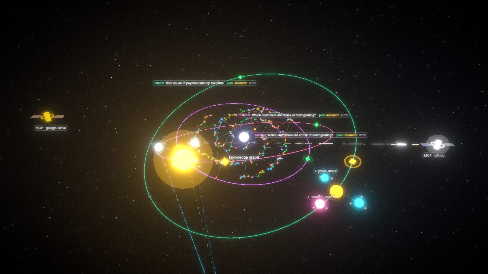
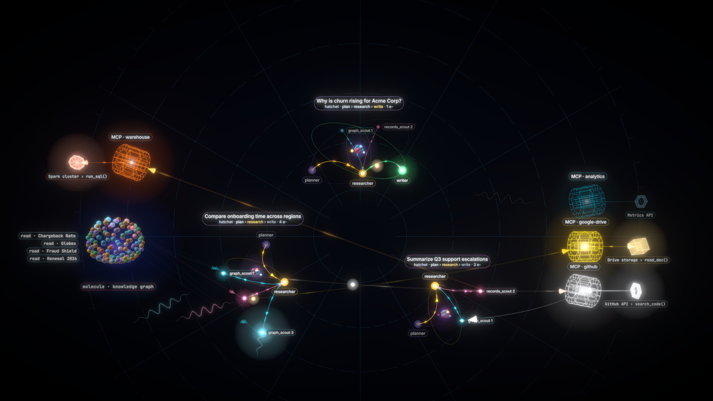
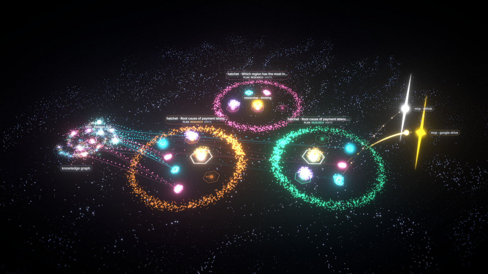

<div align="center">

# AgentGlow

**Watch your AI agents work live, in 3D, from the OpenTelemetry they already emit.**

[](https://pypi.org/project/agentglow/)
[](https://www.npmjs.com/package/agentglow)
[](LICENSE)



</div>

Agents spawn as glowing shapes, pulse on every LLM call, fan out to subagents, query MCP servers and databases,
and fade when they finish. One line of Python. Works with **LangChain, LangGraph, deepagents, OpenAI Agents SDK,
Hatchet, MCP**, and **Claude Code** itself.

## Get started

Pick your path. Each one ends at **http://localhost:8100/neural** (no agents yet? try `?sim=1`).

### 1. Claude Code (only Node needed)
```bash
npx agentglow setup                  # once: hooks + traces into ~/.claude/settings.json (backed up), opens the 3D view
claude                               # then just use Claude Code as usual
```
The server runs in the background (on macOS/Linux it also starts at login and restarts on crash; on Windows it starts with each `claude` session); watch at http://localhost:8100/neural. Undo with `npx agentglow remove`.
uv and Python are fetched automatically on first run. Just trying it? `npx agentglow claude` runs one session with
AgentGlow attached and installs nothing.
Or install it as a Claude Code plugin (hooks, server auto-start, the skill and `/agentglow:open`), inside Claude Code:
```
/plugin marketplace add Nideesh1/agentglow
/plugin install agentglow@agentglow
```
Use the plugin or `npx agentglow setup`, not both for hooks (setup detects the plugin and adds only the traces env,
which plugins cannot set; without it LLM pulses show 0 tokens). Details: [examples/claude-code](examples/claude-code#claude-code-plugin).
Prefer asking Claude? Install the [agentglow skill](skills/agentglow) and say *"show my agents in 3D"*:
```bash
mkdir -p ~/.claude/skills/agentglow && curl -fsSL \
  https://raw.githubusercontent.com/Nideesh1/agentglow/main/skills/agentglow/SKILL.md -o ~/.claude/skills/agentglow/SKILL.md
```

### 2. Python agents (LangChain, LangGraph, deepagents, OpenAI Agents SDK, Hatchet)
```bash
uvx agentglow serve                  # or: pip install agentglow && agentglow serve
uv add "agentglow[langchain]"        # in your agent project ([openai-agents] for the OpenAI Agents SDK)
```
```python
import agentglow
agentglow.watch()                    # one line, before your agents run
```
Already sending traces to Langfuse / LangSmith / a collector? Nothing changes: `watch()` adds AgentGlow alongside.
Any OTel exporter can also send OTLP/HTTP straight to `http://localhost:8100/v1/traces`.

### 3. Hand-written agent loop (no framework)
```python
async with agentglow.run(topic="Inbound call", scope=clinic_id):
    async with agentglow.agent("receptionist") as a:
        a.llm(model="gpt-realtime", tokens_in=812, tokens_out=64)
        with agentglow.tool("book_appointment", args={"slot": "Tue 10:30"}): ...
        a.final("Booked Tue 10:30")
```
Nested `agentglow.agent(...)` = subagent; also `agentglow.mcp(...)`, `agentglow.graph(...)`, `@agentglow.traced_agent`,
`@agentglow.traced_tool`. See [examples/custom-loop](examples/custom-loop).

### 4. The full demo stack (Hatchet + deepagents + MCP + FalkorDB)
```bash
cp .env.example .env                 # add one LLM key (OpenAI, Anthropic or Gemini) - that's all the setup
docker compose up                    # then open http://localhost:8101 and press ▶ Run agents
```
Pick a workflow next to the button: **Churn brief** (plan, research, write) or **Incident triage** (a runbook skill,
parallel steps across two MCP servers, a review that fails once and retries, a postmortem).
Optional Langfuse side by side: `./scripts/gen-obs-env.sh` then `LANGFUSE_EXPORT=1 docker compose --profile langfuse up -d`.

▶ [Watch the demo in HD](docs/media/hero.mp4)

## 5 themes

| | | |
|:-:|:-:|:-:|
|  **neural** |  **constellation** |  **orbit** |
|  **atom** |  **flow** | |

## In your React / Next.js app

```bash
npm i agentglow
```
```tsx
import { AgentScene } from "agentglow";

<div style={{ height: 600 }}>                {/* the scene fills its container - give it a height */}
  <AgentScene theme="neural" source="http://localhost:8100" />
</div>
```
| Prop | Default | |
|---|---|---|
| `theme` | `"neural"` | one of the 5 themes: `neural`, `constellation`, `orbit`, `atom`, `flow` |
| `source` | `""` (same origin) | your `agentglow serve` URL (default port 8100). In a deployed app, use a URL your users' browsers can reach, e.g. `https://agentglow.yourco.com` |
| `hud` | `true` | overlay panels (title, agent list, event log, stats); `hud={false}` = just the 3D scene |
| `sim` | `false` | built-in fake agents, no server needed (also kicks in automatically if `source` is unreachable) |
| `style` | - | inline styles for the container, e.g. `{{ height: "80vh" }}` |
| `className` | - | CSS class for the container |
| `scope` / `run` | - | show only one user's/tenant's runs, or a single run (see [Security](#security--multi-user)) |
| `token` | - | viewer token minted by your backend; sent as `Authorization: Bearer` |

```tsx
<AgentScene theme="constellation" sim hud={false} style={{ height: 400 }} />   // demo background, no server
```
Works in Next.js App Router out of the box (the package is `"use client"`). See [examples/react-embed](examples/react-embed).

## Security & multi-user

Everything is open by default for local dev. For a shared or public deployment, turn on what you need:

| | Server | Producers / viewers |
|---|---|---|
| **Ingest key** (who can send spans) | `AGENTGLOW_INGEST_KEY=k1,k2` (comma list = rotation) | `agentglow.watch(api_key=...)` or `AGENTGLOW_API_KEY`; OTLP: `OTEL_EXPORTER_OTLP_HEADERS="x-api-key=..."`; Claude Code reads `$AGENTGLOW_API_KEY` |
| **Viewer tokens** (who sees what) | `agentglow serve --secret $AGENTGLOW_SECRET` | your backend mints `agentglow.make_token(secret, scope=..., run=..., ttl_s=3600)`; the scene sends it as `Authorization: Bearer` |
| **Scopes** (show each user only their agents) | runs tagged with `with agentglow.scope(user.id):` | `<AgentScene scope={user.id} token={token} />`; one run: `run="<id>"` or `/neural?run=<id>` |

```python
import agentglow
agentglow.watch(api_key=os.environ["AGENTGLOW_API_KEY"])
with agentglow.scope(user.id):        # every span inside (incl. asyncio tasks) carries agentglow.scope
    graph.invoke({"messages": [...]})

token = agentglow.make_token(os.environ["AGENTGLOW_SECRET"], scope=user.id, ttl_s=3600)  # no scope/run = admin
```
```tsx
<AgentScene source="https://agentglow.yourco.com" scope={user.id} token={token} />
```
Tokens and keys always travel in headers, never in URLs. Not using Python on the backend? The token is a 3-line HMAC,
see [docs/SPEC.md "Scopes & auth"](docs/SPEC.md#scopes--auth).

**Privacy:** every ingestion path drops identity attributes (emails, user/account/org ids) and raw user prompts and
redacts secret-looking values before anything reaches the stream ([docs/SPEC.md](docs/SPEC.md#privacy)). Keep
patient/customer data (names, phone numbers, ids) out of agent names, tool args and final text.

**Your own prompts (opt-in, local only):** `npx agentglow setup --capture-prompts` (or `AGENTGLOW_CAPTURE_PROMPTS=1
agentglow serve --host 127.0.0.1`) keeps your Claude Code prompts, secrets redacted and capped at 2000 chars, so the
agent panel shows each turn as "you: ... / claude: ...". Off by default. It only works when the server listens on
loopback (`127.0.0.1` / `localhost` / `::1`); on any other host the flag is ignored with a startup warning, so a
shared server never receives prompts. `npx agentglow status` shows `prompts: captured (local only)` when it is on.

## What shows up

| Your system | In the scene |
|---|---|
| agents / subagents | shapes that spawn, think, wait and exit - subagents smaller, linked to their parent with directional edges |
| LLM calls | pulses sized by tokens |
| tool & MCP calls | MCP server + its backends (Postgres, Snowflake, Spark…) appear at the side when first called, with data-flow arrows; idle ones fade away |
| DB / graph queries (`db.system`) | a knowledge graph appears at the side once agents read or write it (real nodes from FalkorDB if configured) and fades out with the run |
| handoffs | agents chained with a message along the edge |
| skills (Claude Code, deepagents and OpenAI Agents skills, `agentglow.skill`) | a `skill:name` ring on the agent using it |
| Hatchet workflow runs | runs and their steps, whatever they are named, including parallel steps and retries |

**Agents are always the center.** Graphs, databases and MCP servers are side resources that only show up when used, and the camera
frames everything calmly: one smooth zoom per burst of spawns, never a jittery in-and-out. Stats sit in a slim top bar;
agents, events and the selected agent live in a collapsible right sidebar.

**Hundreds of agents?** Above 12 live agents, AgentGlow auto-groups older runs into glowing clusters
("35 runs · 84 agents") and keeps the newest ~10 in full detail - click a cluster to expand it. Stays at ~60 fps with 500 live agents.

Optional span attributes make it richer: `agentglow.agent`, `agentglow.run.topic`, `agentglow.final`,
`agentglow.graph.nodes`, `agentglow.mcp.server` / `.resource` / `.resource_kind`. See [docs/SPEC.md](docs/SPEC.md).

## Examples

| | |
|---|---|
| [quickstart](examples/quickstart) | 40-line deepagents researcher with two subagents - the "just show me" path |
| [langgraph](examples/langgraph) | LangGraph supervisor with worker agents (`langgraph-supervisor` works too) |
| [openai-agents](examples/openai-agents) | OpenAI Agents SDK: handoffs + agent-as-tool |
| [custom-loop](examples/custom-loop) | no framework: a hand-written voice-call loop traced with the manual API (runs without an LLM key) |
| [react-embed](examples/react-embed) | `<AgentScene/>` in a Vite + React app |
| [claude-code](examples/claude-code) | watch **Claude Code** and its subagents in 3D via hooks (+ optional OTel traces for real token counts) - no code |
| [deepagents-hatchet](examples/deepagents-hatchet) | the full stack: Hatchet + deepagents + MCP + FalkorDB, one `docker compose up` |

Every Python example takes `AGENT_MODEL` - e.g. `openai:gpt-5.6-luna`, `anthropic:claude-sonnet-5`, `google_genai:gemini-3.8-flash`.

## Production

Run **one** `agentglow serve` per environment (Docker image / k8s Deployment with `replicas: 1`) and point every app
pod at it: `agentglow.watch("http://agentglow:8100")`. If it's down, your app is unaffected - spans are just dropped.
Turn on the ingest key and viewer tokens (see [Security & multi-user](#security--multi-user)).

## Develop

One [uv](https://docs.astral.sh/uv/) workspace (root `pyproject.toml`, single `uv.lock`; members `backend` + the Python examples).

```bash
uv sync --all-packages                              # everything into ./.venv
(cd frontend && npm ci && npm run build:app)        # bundle the UI into backend/agentglow/static
uv run agentglow serve                              # :8100
uv run --package agentglow pytest backend/tests -q
uv build --package agentglow --out-dir dist         # sdist + wheel
```

| Path | |
|---|---|
| `backend/` | Python package `agentglow`: server, `watch()`, OTel → agent mapping, Claude Code hooks |
| `frontend/` | the 3D scenes; npm package `agentglow` + the app bundled into the Python package |
| `examples/` | real agent stacks instrumented with one line |

MIT licensed.
