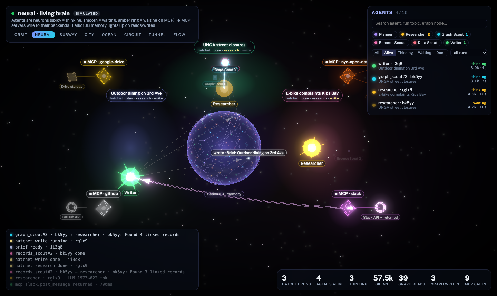
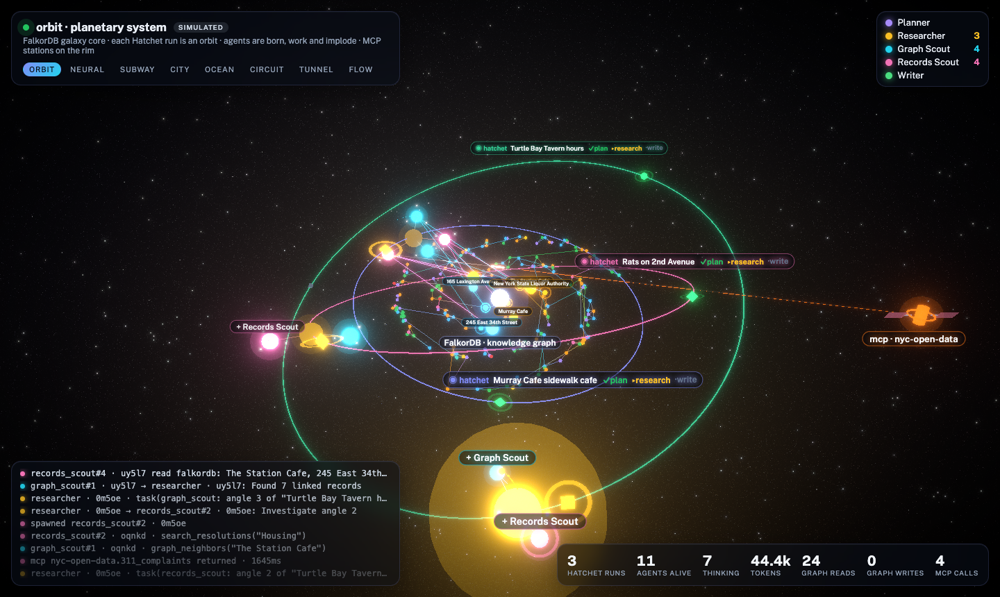
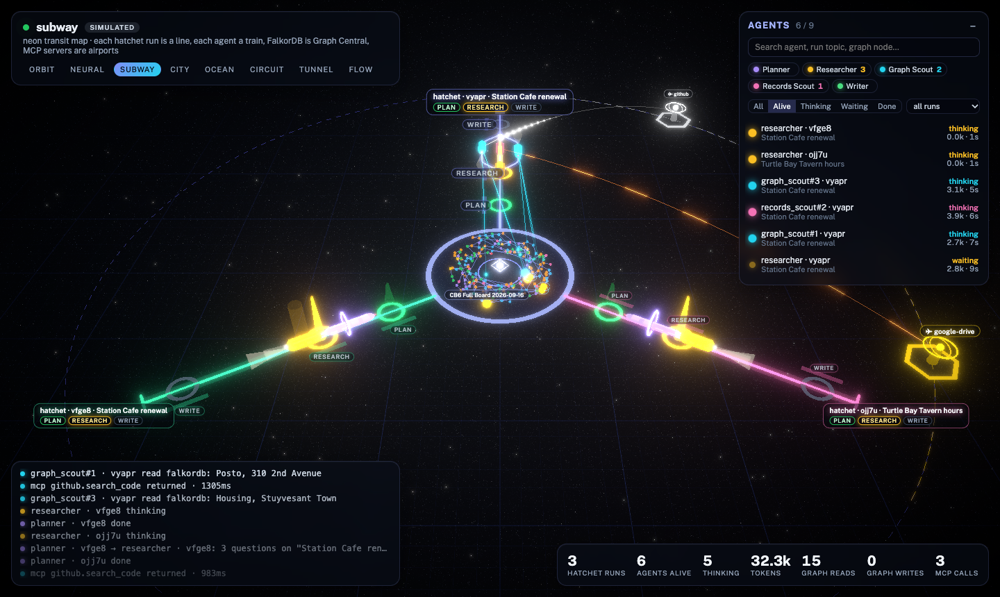
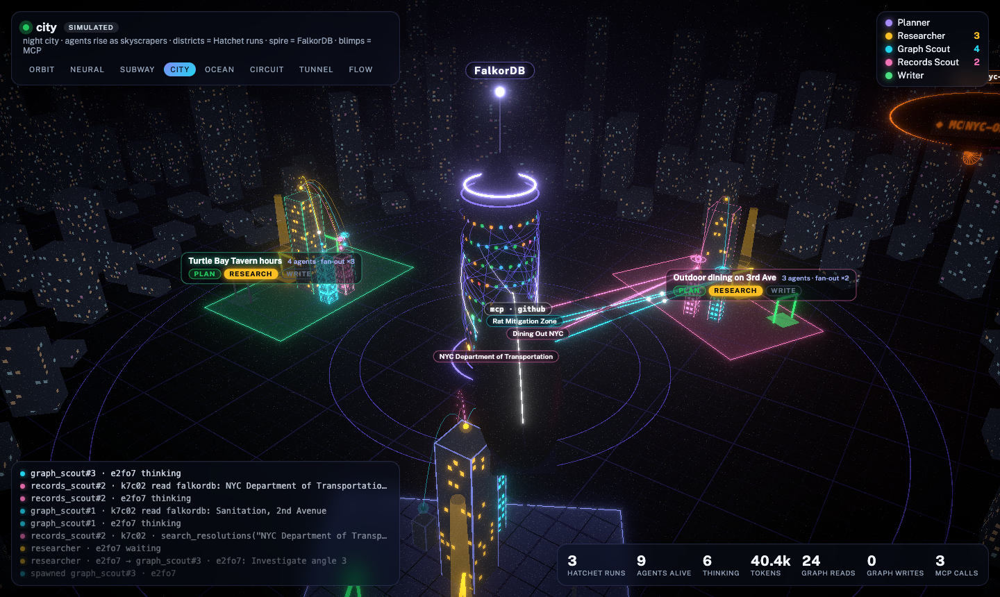
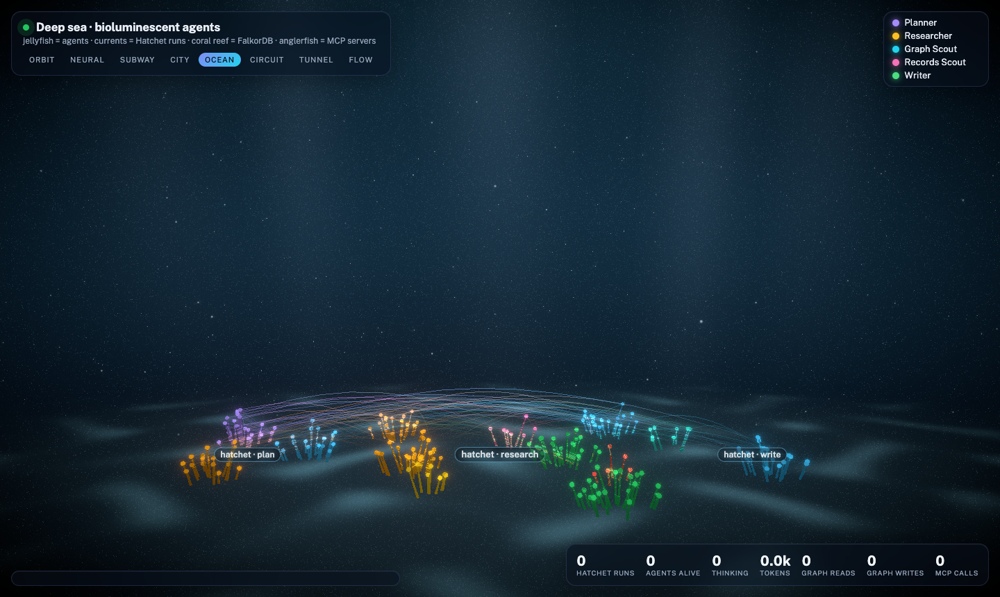
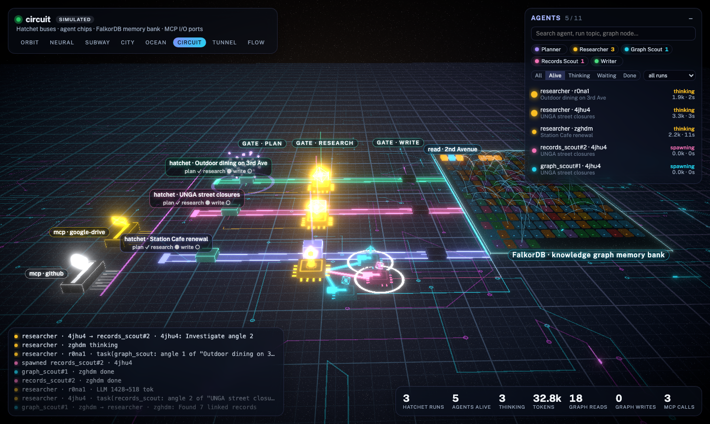
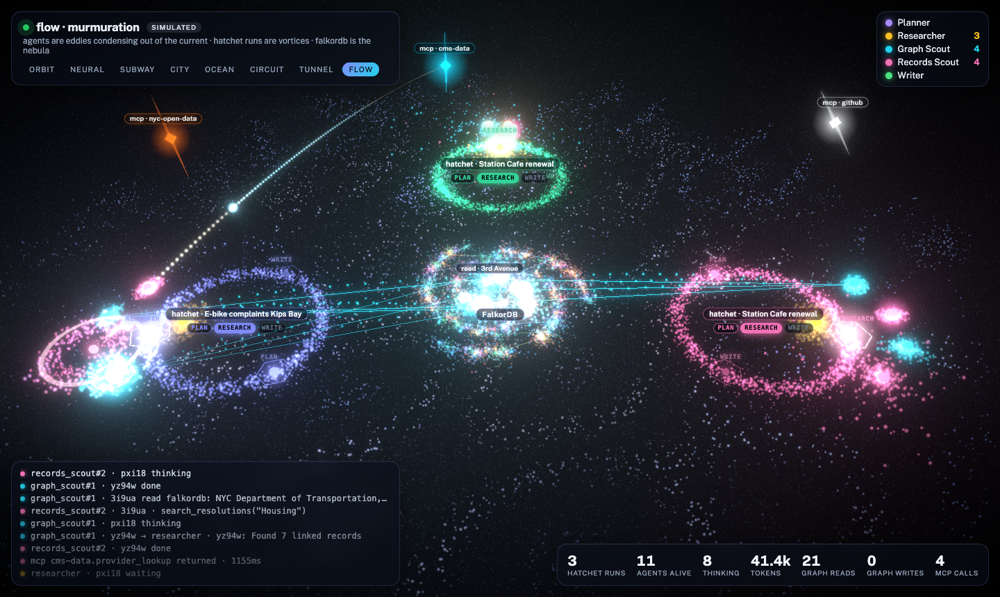

# AgentGlow

**Watch your AI agents work — live, in 3D — from the OpenTelemetry they already emit.**

Agents spawn as glowing shapes, pulse on every LLM call, fan out to subagents, query MCP servers and databases,
and fade when they finish. Works with LangChain, LangGraph, deepagents, Hatchet, and anything that speaks OTel.



## Quickstart

```bash
pip install "agentglow[langchain]"
agentglow serve                 # → http://localhost:8100
```
```python
import agentglow
agentglow.watch()               # one line, before your agents run
```
Open **http://localhost:8100/neural** and run your agents. No agents yet? Try `http://localhost:8100/neural?sim=1`.

Already sending traces to Langfuse / LangSmith / a collector? Nothing changes — `watch()` adds AgentGlow alongside.

## In your React / Next.js app

```bash
npm i agentglow
```
```tsx
import { AgentScene } from "agentglow";

<AgentScene theme="neural" source="http://localhost:8100" />
```
Next.js: load it with `dynamic(() => import("agentglow").then(m => m.AgentScene), { ssr: false })`.

## Themes

`neural` · `orbit` · `subway` · `city` · `ocean` · `circuit` · `tunnel` · `flow`

| | | |
|---|---|---|
|  |  |  |
|  |  |  |

## What shows up

| Your system | In the scene |
|---|---|
| agent / subagent spans | shapes that spawn, think, wait, and exit — subagents smaller, linked to their parent |
| LLM calls | pulses sized by tokens |
| MCP calls | MCP server + backend nodes (Postgres, Snowflake, Spark…), tether while waiting, data-flow arrows |
| DB / graph queries (`db.system`) | the knowledge-graph sphere lights up the nodes read or written |
| Hatchet workflow runs & steps | runs and their step-by-step progress |

Optional span attributes make it richer: `agentglow.graph.nodes`, `agentglow.mcp.server` / `.resource` / `.resource_kind`,
`agentglow.agent`, `agentglow.run.topic`, `agentglow.final`. See [docs/SPEC.md](docs/SPEC.md).

## Production

Run **one** `agentglow serve` per environment (Docker image / k8s Deployment with `replicas: 1`) and point every app
pod at it: `agentglow.watch("http://agentglow:8100")`. If it's down, your app is unaffected — spans are just dropped.

## Example: deepagents + Hatchet + MCP + FalkorDB

```bash
cp .env.example .env            # add GEMINI_API_KEY; ./scripts/gen-obs-env.sh for Langfuse/Hatchet secrets
docker compose up
```
See [examples/deepagents-hatchet](examples/deepagents-hatchet/README.md).

## Repo

| Path | |
|---|---|
| `backend/` | Python package `agentglow` — server, `watch()`, OTel → agent mapping |
| `frontend/` | the 3D scenes; npm package `agentglow` + the app bundled into the Python package |
| `examples/` | real agent stacks instrumented with one line |

MIT licensed.
