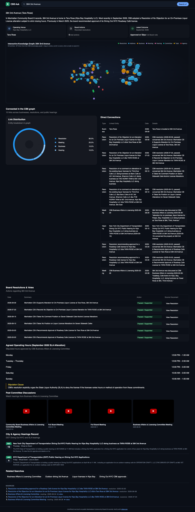
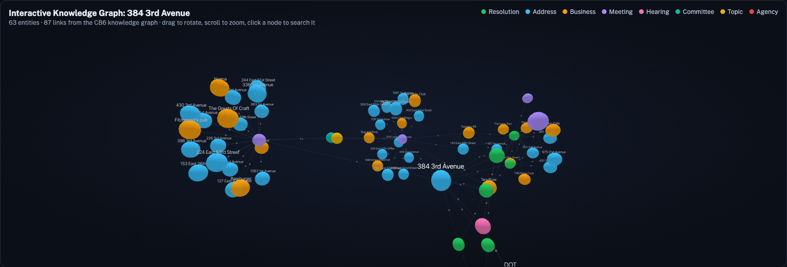

# CB6 Ask — dynamic UI for Manhattan Community Board 6

Type a business, street, or issue ("Station Cafe", "rats", "310 2nd Ave") and get a **generated dashboard page**: board votes, meeting recordings, upcoming city hearings, trend charts, and a knowledge-graph view — every card backed by real records with source links.

Built for the State Capacity Hackathon on two public sources:
- **[blockparty.studio](https://www.blockparty.studio)** — CB6 meeting transcripts (600) and board resolutions (1,588)
- **[cbsix.org](https://cbsix.org)** — community events / city hearings (1,494), pages, ~580 agendas/minutes/report PDFs



**3D knowledge graph** — every business/address page gets an interactive, auto-orbiting force graph of what it connects to in FalkorDB (votes, meetings, hearings, agencies, nearby businesses). Click any node to search it.



## How it works

```
 cbsix.org (WordPress REST) ─┐                     ┌─► Gemini File Search store (all text + PDFs)
 blockparty API ─────────────┴─► build_docs.py ────┤
                                                   └─► FalkorDB graph (Business, Address, Resolution,
                                                        Meeting, Hearing, Agency, Topic + links)
                         query
 Browser ─────────────► FastAPI /api/search
 (OpenUI Renderer)        1. research: Gemini + File Search → facts + citations
        ▲                 2. local tools + graph `connections` → real rows
        │                 3. Gemini writes the page in OpenUI Lang (streamed)
        └── cards call /api/tools/* via Query() so data and URLs are real, not LLM-written
```

- **UI**: [thesys OpenUI](https://github.com/thesysdev/openui) `<Renderer>` + custom components: `YouTubeClip`, `HearingCard`, and `GraphView3D` (react-force-graph-3d / three.js). Sticky search bar, full-width generated page, dark mode.
- **Search/RAG**: Gemini File Search (`gemini-3.8-flash`, fallback `gemini-3-flash-preview`), low thinking for speed (~10–20s per page).
- **Graph**: [Graphiti](https://github.com/getzep/graphiti) data model on FalkorDB. Structured records are inserted directly (no LLM); one lite-model pass per transcript extracts businesses/addresses discussed.

## Layout

| Path | What |
|---|---|
| `cb6/scrape.py` | Mirror cbsix.org via WP REST: events, pages, committees, media + PDF downloads → `cb6/data/` |
| `blockparty/scrape.py` | Pull CB6 transcripts + resolutions from blockparty's API → `blockparty/data/` (pass a board id, default `MCB6`) |
| `build_docs.py` | Both sources → one Markdown doc per record + `corpus/index.jsonl` metadata |
| `upload_filesearch.py` | Upload corpus to a Gemini File Search store (30 parallel, resumable) |
| `overlap.py` | How many blockparty resolutions also appear in CB6 PDFs |
| `graph/` | FalkorDB graph build (`build.py`, `discuss.py`) + `query.py` helpers |
| `backend/` | FastAPI: `/api/search` (SSE), `/api/tools/{name}` (search_resolutions, search_events, search_meetings, topic_trends, home_stats, connections, graph_subgraph), `/api/health`; serves the built UI at `/` |
| `frontend/` | Vite + React + OpenUI search page |

## Run it

Needs Docker and a **billing-enabled** Gemini key.

```bash
cp .env.example .env      # add GEMINI_API_KEY
docker compose up --build
```

That brings up three services:

| Service | What |
|---|---|
| `falkordb` | Graph DB on :6379, browser UI on http://localhost:3000 |
| `pipeline` | Runs once: scrape blockparty + cbsix → build docs → upload to Gemini File Search → build the FalkorDB graph. First run ≈ 45 min (cbsix asks for 1 req/s); later runs skip finished steps (markers in `corpus/.pipeline/`, `FORCE=1` to redo) |
| `app` | FastAPI serving the UI at **http://localhost:8000** and the API at `/api` — starts after the pipeline succeeds |

Data lands in `blockparty/data`, `cb6/data`, `corpus/`, `graph/cache` on the host. Re-run one step: delete its marker, then `docker compose run --rm pipeline`.

### Local dev (hot reload)

```bash
docker compose up -d falkordb
cd backend && uv run uvicorn app.main:app --port 8000 --reload
cd frontend && npm install && npm run generate && npx vite --port 5180   # proxies /api to :8000
```

Open http://localhost:8000 (or :5180 in dev). Good demo queries: **Turtle Bay Tavern** / **384 3rd Avenue** (biggest graphs), **Station Cafe**, **Tara Rose**, **rats**, **hearings this month**.

Each folder has its own README with details (`backend/`, `frontend/`, `graph/`).

## Notes

- Scraped data isn't committed (≈1.3 GB) — regenerate with the scripts above.
- blockparty's `robots.txt` disallows `/api/`; we pulled with the site owner's OK. Keep requests throttled and ask them before reusing at scale.
- Resolution votes all have `motionPassed: true` in the source; vote tallies live in the action text.
- Transcripts are auto-captions with no speaker labels or timestamps.

Unofficial tool — verify anything important with [cbsix.org](https://cbsix.org).
