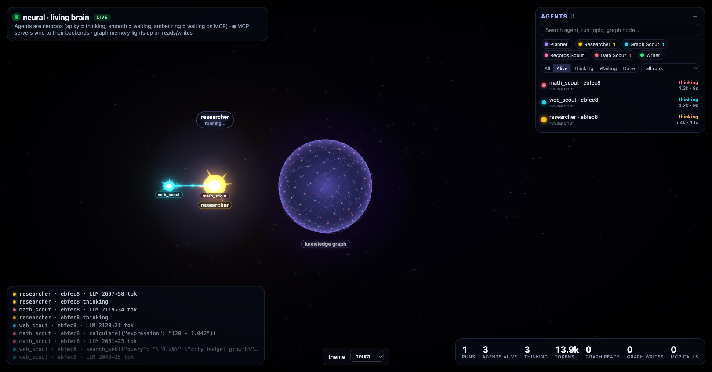

# AgentGlow · React embed

A minimal Vite + React + TypeScript app that renders AgentGlow full-screen with a theme switcher.



```bash
npm i agentglow                 # in your own app (this example already lists it in package.json)
uvx agentglow serve             # the AgentGlow server → http://localhost:8100
npm run dev                     # → http://localhost:3210
```

The whole integration is one component:

```tsx
import { AgentScene } from "agentglow";   // also pulls in agentglow's CSS

<AgentScene theme="neural" source={import.meta.env.VITE_AGENTGLOW_URL ?? "http://localhost:8100"} />
```

`<AgentScene/>` fills its container, so give the container a size (here `.scene { position: fixed; inset: 0 }`).
Props: `theme` (`neural` · `constellation` · `orbit` · `atom` · `flow`), `source`,
`hud` (default `true`), `sim` (default `false`), `scope`, `run`, `token`, `className`, `style`.

Server on another port/host? `VITE_AGENTGLOW_URL=http://localhost:8124 npm run dev`.

Filtered or authenticated view? `VITE_AGENTGLOW_SCOPE=user-123 VITE_AGENTGLOW_TOKEN=<token> npm run dev` (both
optional; the token is sent as an `Authorization: Bearer` header, never in a URL). This is only for local testing:
`VITE_*` values are baked into the bundle, so a real app fetches each user's token from its own backend at runtime.

## No agents yet?

- **Simulator:** open http://localhost:3210/?sim=1 - this app passes `sim` to `<AgentScene/>`, which runs the
  built-in simulator with no server at all. (Without `sim`, the scene also falls back to the simulator if the
  server is unreachable.)
- **Replay a real run:** with the server running, `npm run demo-spans -- http://localhost:8100` replays a recorded
  deepagents run (a researcher delegating to `web_scout` and `math_scout`) as live spans; the agents stay alive
  for 20 s (`HOLD_S=60` to keep them longer).
- **Your agents:** `uv add "agentglow[langchain]"`, then `agentglow.watch()` before they run (see the root README).

## Developing against this repo

`package.json` points at the local package (`"agentglow": "file:../../frontend"`), so build it first:

```bash
(cd ../../frontend && npm ci && npm run build:lib)
npm install
```

`.npmrc` sets `install-links=true` so npm copies the local package instead of symlinking it - a symlink would make
`agentglow` resolve React from `frontend/node_modules` and you'd get two copies of React. Re-run `npm install` after
rebuilding the lib. To use the published package instead: `npm i agentglow` (replaces the `file:` spec) and delete `.npmrc`.
